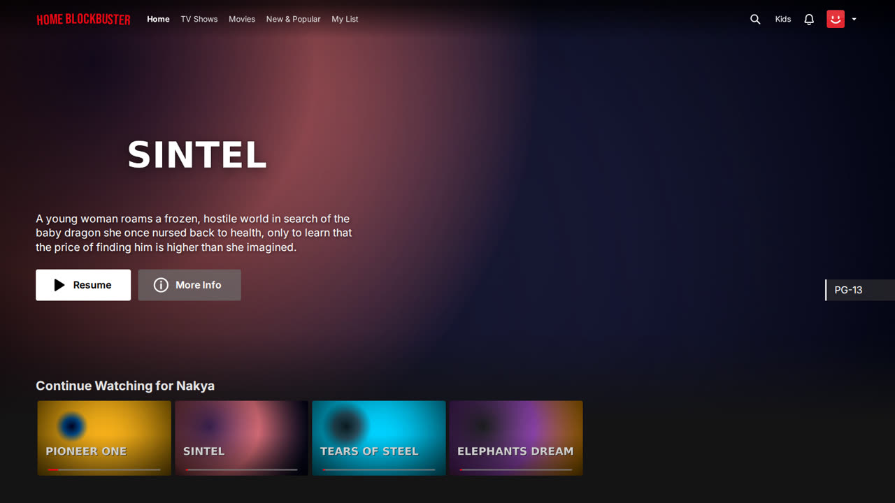
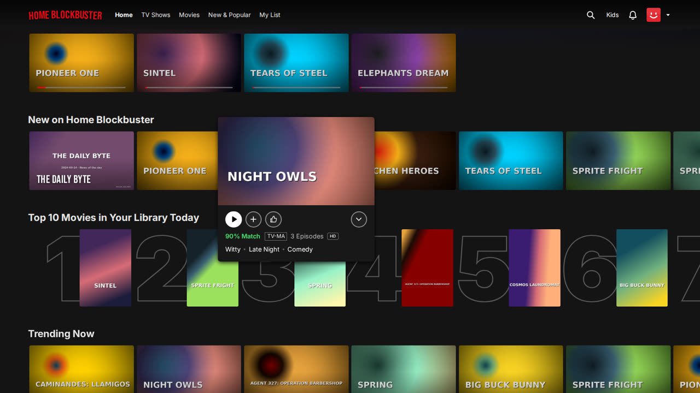
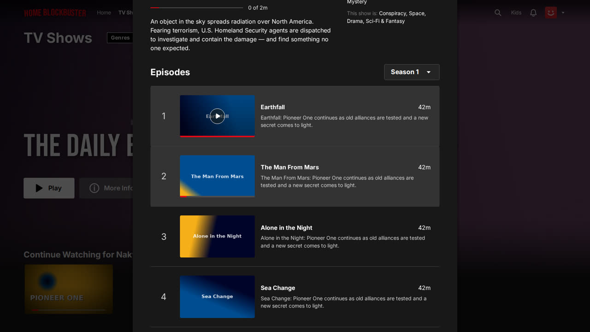
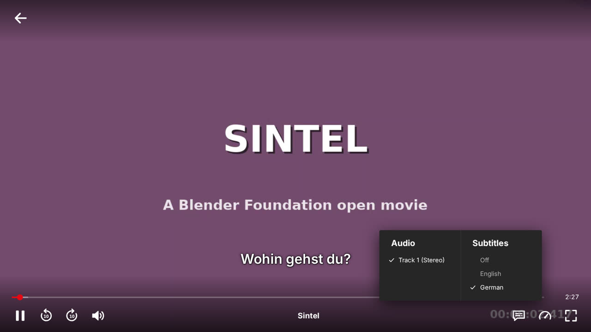
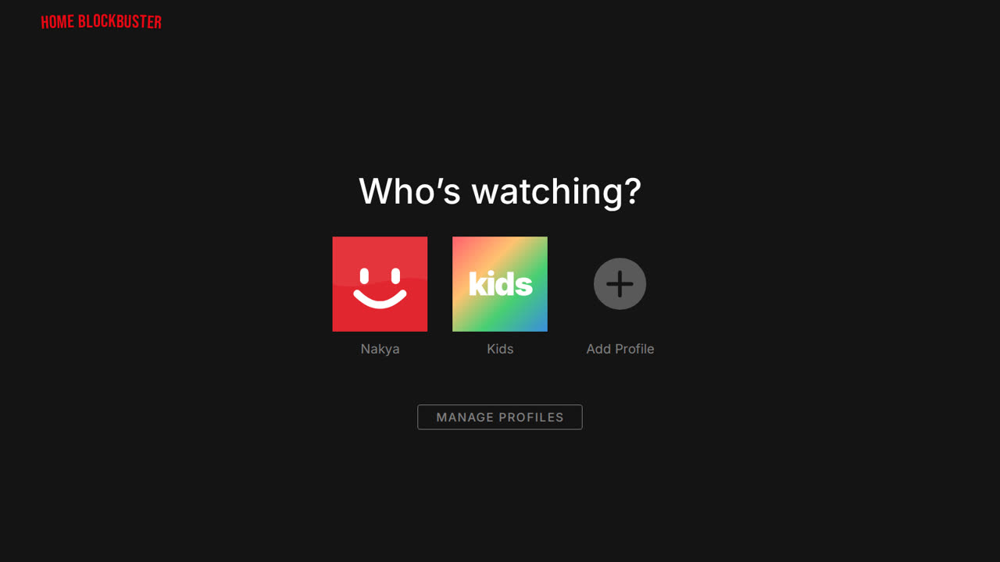

# Home Blockbuster

A self-hosted, Netflix-style streaming experience for the movies and TV shows you already own — on a **NAS**, a **server**, an **external drive** or your computer's **internal drive**.

Point it at your folders. It finds your videos, reads the tags and cover art embedded in the files (MP4/iTunes atoms, Matroska tags, ID3), fetches posters, backdrops, title logos, cast, genres and episode details from **free metadata APIs**, and presents everything in an interface that looks and feels like Netflix — billboard previews, hover cards, Top 10 rows, "Continue Watching", profiles and a full-featured player.



| Hover card | Title details & episodes |
| --- | --- |
|  |  |
| **Player with subtitles** | **Who's watching?** |
|  |  |

<sub>Screenshots show the synthetic demo library from `scripts/generate-demo-media.mjs`.</sub>

## Features

**Your media, wherever it lives**
- Libraries for movies, TV shows or mixed folders on local disks, external/USB drives, mounted NAS shares (SMB/CIFS, NFS), Windows UNC paths (`\\NAS\Movies`) and Docker volumes.
- A built-in folder browser that shows drives, `/Volumes`, `/mnt`, `/media`, home folders and custom roots, with a reachability check before you save.
- Understands Plex/Jellyfin naming, scene releases, anime, daily shows, multi-episode files, editions, parts and IMDb/TMDB ids in names. Skips samples, extras and NAS system folders (`@eaDir`, `#recycle`…).
- Incremental rescans (only new or changed files are read) and automatic scheduled scans.
- **Offline-safe**: if a drive or share is disconnected, its titles are kept and the library is marked offline instead of being wiped.
- Read-only: your files are never moved, renamed or modified.

**Metadata, artwork & tags**
- Embedded metadata is read first: title, year, genre, description, show/season/episode atoms and **cover art** (MP4 `covr`, Matroska attachments, ID3 pictures).
- Online metadata from free services: **TMDB** (free API key — best results: textless backdrops, logos, cast, keywords, episode stills), **TVmaze** and the **iTunes Search API** (no key needed), **OMDb** (free key).
- Fuzzy matching with year checks, automatic merging of duplicates, and a **Fix match** dialog to pick the right entry by hand.
- Frames grabbed from the video itself when a title or episode has no artwork.

**The Netflix experience**
- Profile gate ("Who's watching?"), up to 5 profiles with avatars, **Kids profiles** (only G/PG/TV-G… titles), per-profile My List, thumbs ratings, history and autoplay settings.
- Billboard with muted **autoplay preview** from your own file, rows with page sliders, **hover mini-modals** that grow out of the card, Top 10 rows with big rank numbers, "Because you watched…", genre rows, New & Popular, search across titles, people and genres, notifications for new arrivals.
- Detail modal with season picker, episode list with progress, More Like This and About sections.
- Player with Netflix-style controls: scrubber with **frame previews**, ±10 s, volume, audio track and subtitle selection, playback speed, episodes panel, **next-episode countdown**, "You're watching" pause screen and keyboard shortcuts.

**Playback that just works**
- Direct play with HTTP range requests for browser-friendly files.
- On-the-fly **remux** (e.g. MKV → MP4, AC3 → AAC) or **transcode** (HEVC, 10-bit, DivX/Xvid…) with ffmpeg, chosen per browser. Browsers without H.264/AAC get VP9/Opus.
- Optional hardware encoding: NVIDIA NVENC, Intel Quick Sync, VAAPI, Apple VideoToolbox.
- Sidecar subtitles (`.srt`, `.vtt`, `.ass`/`.ssa`, any encoding, language/forced/SDH detection) and embedded text subtitles.
- Resume where you left off, on any device.

## Quick start

### Requirements

- **Node.js 20.19+** (22 LTS recommended)
- **ffmpeg** (recommended): enables transcoding, thumbnails and scrubbing previews. Without it, only browser-friendly files (MP4/WebM with H.264, VP9 or AV1) play.
  - Windows: `winget install Gyan.FFmpeg` · macOS: `brew install ffmpeg` · Debian/Ubuntu: `sudo apt install ffmpeg`

### Install and run

```bash
git clone https://github.com/swissmarley/home-blockbuster.git
cd home-blockbuster
npm ci
npm run build
npm start
```

Open **http://localhost:8585** (or `http://<your-computer's-ip>:8585` from a TV, tablet or phone on the same network). The first-run setup walks you through creating your profile and adding your first library.

No media at hand? Generate a small demo library (requires ffmpeg):

```bash
node scripts/generate-demo-media.mjs --out ./test-media
```

### Docker

```bash
docker compose up -d
```

Edit `docker-compose.yml` first: every folder you want to watch must be mounted into the container (for example `/path/to/Movies:/media/movies:ro`). Inside the app, add libraries using the container paths (`/media/movies`). The image includes ffmpeg; data is stored in `./data`.

The server runs as the unprivileged `node` user (uid 1000), so your media must be readable by that user. On start, the container takes ownership of the data folder, which matters when you upgrade from an older image that ran as root. For VAAPI, also add the host's `render` group with `group_add` (see the compose file).

## Adding your media

Home Blockbuster reads folders **as the server sees them**. Anything the operating system can mount can be a library.

| Where your videos are | What to enter |
| --- | --- |
| Internal drive | `D:\Movies`, `/Users/me/Movies`, `/home/me/Videos` |
| External / USB drive | Windows: its drive letter (`E:\Films`) · macOS: `/Volumes/MyDrive/Films` · Linux: `/media/<user>/MyDrive/Films` |
| NAS on Windows | A UNC path such as `\\NAS\Movies`, or a mapped drive letter (`Z:\`) |
| NAS on macOS | Connect in Finder (⌘K → `smb://nas.local/Movies`), then use `/Volumes/Movies` |
| NAS on Linux | Mount it, e.g. `sudo mount -t cifs //nas/Movies /mnt/nas/movies -o ro,guest,uid=$(id -u)` or add it to `/etc/fstab`; NFS: `sudo mount -t nfs nas:/volume1/Movies /mnt/nas/movies`. Then use `/mnt/nas/movies` |
| NAS with Docker | Use the CIFS/NFS volume examples in `docker-compose.yml`, or mount on the host and bind-mount the folder |
| Running directly on the NAS | Synology `/volume1/video`, QNAP `/share/Multimedia`, Unraid `/mnt/user/media`… |

`smb://` URLs can't be read directly — mount the share first (this is also how Plex and Jellyfin work).

### Naming tips

Most names work as they are, but these patterns give the most reliable matches:

```
Movies/Inception (2010)/Inception (2010).mkv
Movies/The Matrix (1999) {imdb-tt0133093}.mp4
TV Shows/Breaking Bad (2008)/Season 01/Breaking Bad - S01E01 - Pilot.mkv
TV Shows/The Daily Show/The Daily Show 2024-03-14.mp4
Subtitles next to the video: Inception (2010).en.srt, Inception (2010).de.forced.srt
```

Choose the library type (**Movies**, **TV Shows** or **Mixed**) when adding a folder — it helps with ambiguous names. If something is matched wrongly, open the title and use **Fix match**.

## Metadata providers

| Provider | Key | Used for |
| --- | --- | --- |
| [TMDB](https://www.themoviedb.org/settings/api) | Free API key (v3 key or v4 read-access token) | Movies & shows: textless backdrops, title logos, posters, cast, crew, keywords, maturity ratings, episode names and stills |
| [TVmaze](https://www.tvmaze.com/api) | None | TV shows, seasons, episodes, images |
| [iTunes Search API](https://performance-partners.apple.com/search-api) | None | Movie and TV posters, descriptions, ratings |
| [OMDb](https://www.omdbapi.com/apikey.aspx) | Free key (1,000 requests/day) | Posters, plots, IMDb ratings |

Enter keys in **Settings → Metadata & Artwork**, or set `TMDB_API_KEY` / `OMDB_API_KEY`. Without any key, TVmaze and iTunes still provide artwork and details, and tags embedded in your files are used as a fallback. Artwork is cached locally after the first view.

## Configuration

All settings are optional environment variables (see `.env.example`):

| Variable | Default | Description |
| --- | --- | --- |
| `PORT` | `8585` | HTTP port |
| `HOST` | `0.0.0.0` | Interface to listen on (`127.0.0.1` for this machine only) |
| `DATA_DIR` | `./data` | Database, artwork cache, thumbnails |
| `HB_PASSWORD` | – | Require a password to use the app (overrides one set in **Settings → Security**) |
| `TRUST_PROXY` | – | Behind a reverse proxy: trust its `X-Forwarded-*` headers (`1` = one hop, or `loopback`, a subnet…). Needed for per-client sign-in rate limits and `Secure` cookies over HTTPS |
| `ALLOWED_HOSTS` | – | Without a password, other host names to answer to, comma separated (`media.example.com`, `.example.com`). IPs, `localhost` and LAN names always work |
| `ALLOW_EXTERNAL_SYMLINKS` | off | Follow symlinks in a library that point outside every library folder |
| `TMDB_API_KEY`, `OMDB_API_KEY` | – | Metadata API keys (also settable in the UI) |
| `FFMPEG_PATH`, `FFPROBE_PATH` | auto-detected | Location of ffmpeg / ffprobe |
| `MEDIA_ROOTS` | – | Extra shortcuts in the folder browser, comma separated (e.g. Docker mounts) |
| `VAAPI_DEVICE` | `/dev/dri/renderD128` | Render node for VAAPI transcoding |
| `LOG_LEVEL` | `info` | `debug`, `info`, `warn` or `error` |
| `IMAGE_CACHE_MAX_MB` | `2048` | Size cap for downloaded artwork |
| `TMDB_API_BASE`, `TMDB_IMAGE_BASE`, `IMAGE_PROXY_EXTRA_HOSTS` | – | Advanced: use a TMDB mirror/proxy, or a local stand-in for testing |

Playback, transcoding, hardware acceleration, thumbnails and the automatic scan interval are configured in **Settings → Playback**.

## Keyboard shortcuts (player)

| Key | Action |
| --- | --- |
| Space / K | Play / pause |
| ← / → | Back / forward 10 seconds |
| ↑ / ↓ | Volume |
| F | Full screen |
| M | Mute |
| Shift + N | Next episode |
| Esc | Back to browsing |

## Security

Home Blockbuster is designed for your home network. Without a password, anyone who can open it can browse the server's folders (in the folder browser), change libraries and settings, and watch your media, so:

- **Set a password** during setup or in **Settings → Security** (or with `HB_PASSWORD`) if other people or untrusted devices share your network. **Never expose it to the internet without one**; ideally use a VPN, or a reverse proxy with HTTPS and `TRUST_PROXY`. Each device signs in once for 30 days. Signing out ends that session, and changing the password signs out every device.
- Without a password, the server only answers to IP addresses, `localhost` and LAN names, which blocks DNS-rebinding attacks from websites. If you use another host name, add it to `ALLOWED_HOSTS`, or set a password.
- Symlinks inside a library are only followed when they point into a library folder (or `MEDIA_ROOTS`), so a link dropped into a shared folder can't publish other files on the server. Set `ALLOW_EXTERNAL_SYMLINKS=1` to follow them anyway.
- The **Kids profile is a filter, not a lock**: it hides titles that aren't rated for children (unrated titles must be tagged family/children) and settings, but anyone can switch profiles.
- `state.json` in the data folder holds your API keys and the session secret; it is readable by the server's user only.
- Mount media read-only where you can (the app never writes to your media folders).

## Development

```bash
npm install
npm run dev          # API on :8585 (auto-reload) + Vite dev server on http://localhost:5173
npm test             # unit and integration tests (Vitest)
npm run typecheck
```

```
server/src
├── library/     scanner, filename parser, tag & cover probing, subtitles, presentation
├── metadata/    TMDB, TVmaze, iTunes, OMDb providers, matching, rate-limited HTTP
├── media/       ffmpeg integration, streaming, playback decisions, image cache
├── routes/      REST API (libraries, titles, profiles, playback, settings, auth)
└── shared/      API types shared with the web client
web/src
├── components/  nav, billboard, rows, cards, hover popup, detail modal…
├── pages/       browse, player, profiles, settings, onboarding, search
└── store/       app state (Zustand)
```

## Credits

Metadata and images are provided by [TMDB](https://www.themoviedb.org), [TVmaze](https://www.tvmaze.com) (CC BY-SA), the iTunes Search API and [OMDb](https://www.omdbapi.com). This product uses the TMDB API but is not endorsed or certified by TMDB.

Home Blockbuster is an independent open-source project. It is not affiliated with, endorsed by or connected to Netflix, Inc. or Blockbuster. All trademarks belong to their respective owners.

## License

[MIT](LICENSE)
